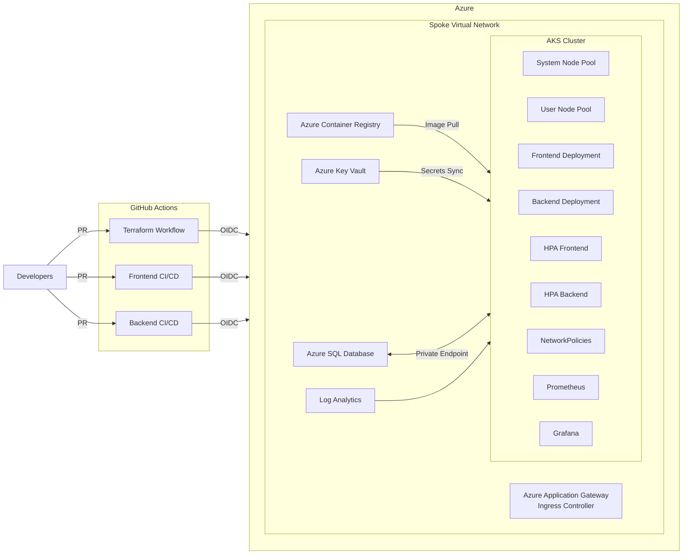

# Cloud-Native Migration on Azure Kubernetes Service

This repository contains infrastructure-as-code, application manifests, and operational runbooks for migrating the legacy three-tier web application to a fully automated, cloud-native platform on Azure Kubernetes Service (AKS).

## Architecture Overview



### Key Design Decisions
- **AKS with system and user node pools** isolates platform services from application workloads while autoscaling user pools for load bursts.
- **Azure Application Gateway Ingress Controller (AGIC)** provides TLS termination, WAF protection, and seamless integration with AKS.
- **Azure SQL Database** is reachable only through a private endpoint in the VNet, eliminating public exposure.
- **Azure Key Vault + CSI Driver** ensures that secrets are stored centrally and mounted into pods securely.
- **Azure Container Registry (ACR)** stores signed container images that are deployed via GitHub Actions pipelines.
- **Observability stack (kube-prometheus-stack)** supplies metrics, dashboards, and alerting integrated with Log Analytics and Application Insights.
- **PodDisruptionBudgets and startup probes** protect availability during maintenance and slow warm-ups, keeping at least two replicas online per workload.
- **GitHub Actions environment gates** require staging approval before production, ensuring human-in-the-loop promotion of the exact container image.

## Repository Structure

```
.
├── apps/
│   ├── backend/            # Spring Boot microservice, Dockerfile, Helm chart, manifests
│   └── frontend/           # React + Vite app, Dockerfile, Helm chart, manifests
├── docs/
│   └── runbooks/           # Operational procedures (deploy, rollback, scaling, secrets)
├── infra/
│   ├── main.tf             # Root Terraform configuration invoking feature modules
│   ├── variables.tf        # Shared variables
│   ├── outputs.tf          # Exported values
│   └── modules/            # Terraform modules (network, aks, acr, app gateway, sql, key vault, monitoring)
├── k8s/cluster/            # Cluster-wide manifests (network policies, ingress, alerts)
└── .github/workflows/      # GitHub Actions pipelines for infrastructure and apps
```

## Automation & Workflows
- **Terraform** workflow runs on pull requests (`plan`) and on `main` with manual approval (`apply`). State is stored remotely in Azure Storage and authenticated using OpenID Connect.
- **Frontend CI/CD** workflow runs tests on pull requests and, on `main` pushes, builds and scans a container image, publishes it to ACR, deploys to a gated staging namespace, and then promotes the exact tag to production after a second approval.
- **Backend CI/CD** workflow mirrors the frontend pipeline with Maven build/test stages, immutable image publish, staging deployment, and production promotion to prevent bypassing staged validations.

GitHub Actions requires the following secrets or environment variables:

- `AZURE_CLIENT_ID`, `AZURE_TENANT_ID`, `AZURE_SUBSCRIPTION_ID` – federated credentials for workload identity federation.
- `ACR_NAME`, `AKS_RESOURCE_GROUP`, `AKS_CLUSTER_NAME` – application deployment targets.
- `FRONTEND_HOST`, `FRONTEND_TLS_SECRET`, `FRONTEND_API_BASE` – production ingress host, TLS secret name, and backend API base path.
- `FRONTEND_STAGING_HOST`, `FRONTEND_STAGING_TLS_SECRET`, `FRONTEND_STAGING_API_BASE` – staging ingress configuration.
- `DB_JDBC_URL`, `DB_USERNAME`, `BACKEND_PROD_SECRET_NAME` (optional override) – production database connectivity for the backend release.
- `DB_STAGING_JDBC_URL`, `DB_STAGING_USERNAME`, `BACKEND_STAGING_SECRET_NAME` – staging database connectivity/secret wiring.

## Terraform Modules
- **network** – provisions the hub virtual network, subnets (system, Application Gateway, SQL), network security groups, and DNS zone links.
- **appgw** – creates a WAF_v2 Application Gateway with a user-assigned managed identity and exposes it via a static public IP for the ingress controller.
- **aks** – deploys the AKS cluster with system/user pools, OIDC workload identity, Azure Policy, Key Vault CSI driver, and integrates AGIC with the Application Gateway.
- **acr** – deploys the geo-redundant Azure Container Registry used by both pipelines.
- **keyvault** – configures the centralized secret store and grants access to AKS, App Gateway, and GitHub Actions federated credentials.
- **sql** – manages the Azure SQL logical server, database, and private endpoint wired into the VNet + private DNS zone.
- **monitoring** – provisions Log Analytics, optional Application Insights, and installs the kube-prometheus-stack via Helm when requested.

Key input variables include `vnet_cidr`, `aks_subnet_cidr`, `app_gateway_subnet_cidr`, `app_gateway_certificate_secret_id`, and `grafana_hostname`. Create a `terraform.tfvars` file or GitHub Actions environment secrets to populate environment-specific values.

## Security
- GitHub Actions authenticates to Azure using **federated credentials (OIDC)**; no secrets are stored in plaintext.
- **Azure Key Vault** holds connection strings, certificates, and sensitive configuration consumed via the Azure Key Vault CSI driver.
- **NetworkPolicies** restrict lateral movement between namespaces; the SQL database is reachable only from backend pods on specific ports.
- **Container image scanning** is enforced before deployments via Trivy steps in the workflows.
- **RBAC** is provisioned for least privilege, granting only necessary namespace permissions to CI/CD service principals.
- **Application Gateway WAF** terminates TLS certificates stored in Key Vault via a managed identity, satisfying HTTPS-only requirements.

## Observability & SLOs
- Terraform deploys **kube-prometheus-stack**, Grafana dashboards, and Alertmanager routes for latency and error budgets.
- Application Insights is enabled for tracing backend dependencies.
- Service-level objectives (SLOs) are defined as:
  - ≥300 requests/second sustained throughput
  - p95 latency ≤300 ms
  - ≥3 replicas for stateless workloads
  - Zero-downtime rolling updates validated with readiness and liveness probes

## Getting Started
1. Configure the required secrets in the Azure subscription and create an Azure Storage account + container for Terraform state.
   - Upload the TLS certificate (PFX) to Azure Key Vault and capture its secret ID for `app_gateway_certificate_secret_id`.
2. Update the variable defaults or create a `terraform.tfvars` file with environment-specific values (resource group, region, SKU sizes, subnet CIDRs, certificate secret ID, etc.).
3. Commit and push changes. GitHub Actions handles Terraform planning/apply and application deployment pipelines automatically.

Refer to the [runbooks](docs/runbooks) for day-two operations such as manual deploys, rollbacks, scaling events, and secret management.
